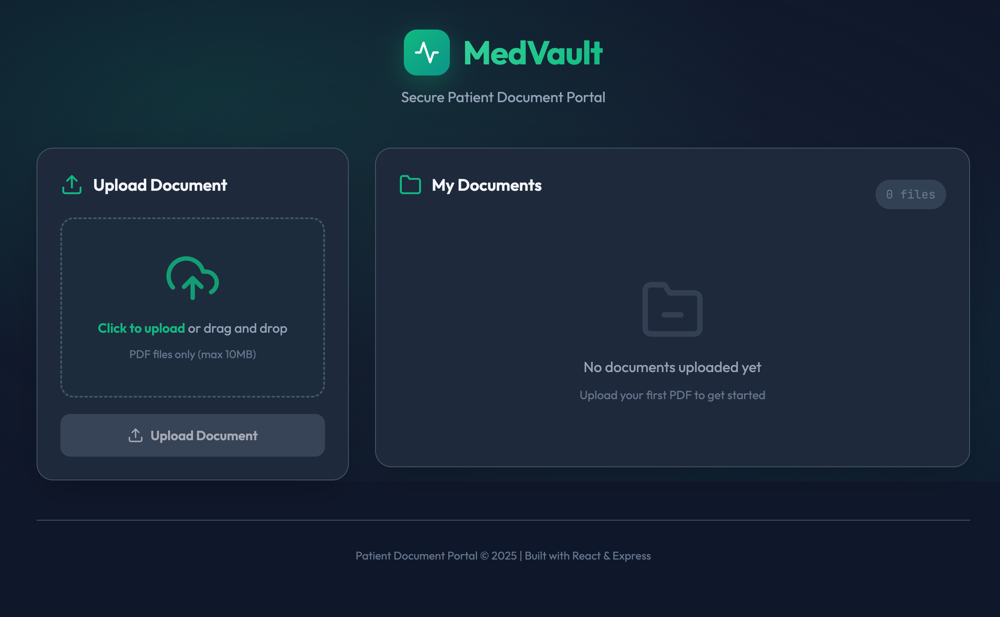
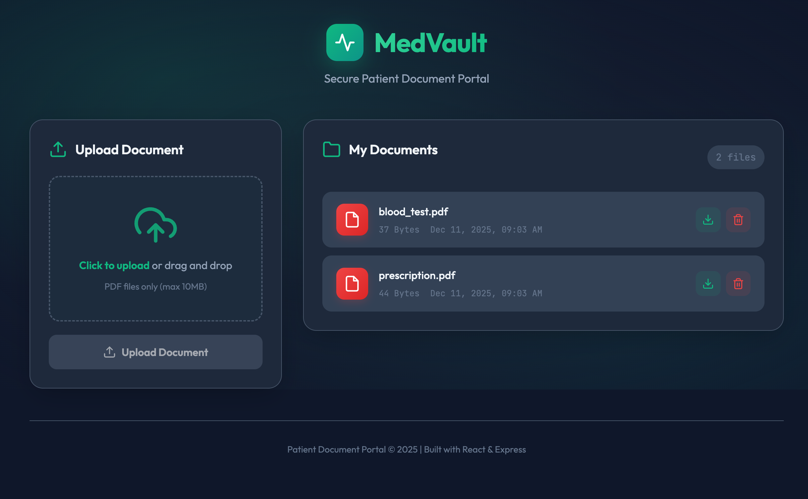

# 🏥 MedVault - Patient Document Portal

A full-stack web application for managing patient medical documents (PDFs). Built as part of a Full Stack Developer Intern assignment.


## 📋 Table of Contents

- [Features](#-features)
- [Project Structure](#-project-structure)
- [Prerequisites](#-prerequisites)
- [Installation & Setup](#-installation--setup)
- [Running the Application](#-running-the-application)
- [API Documentation](#-api-documentation)
- [Example API Calls](#-example-api-calls)
- [Screenshots](#-screenshots)
- [Tech Stack](#-tech-stack)

## ✨ Features

- **Upload PDF Documents**: Drag & drop or click to upload medical documents
- **View All Documents**: See a list of all uploaded documents with metadata
- **Download Documents**: Download any uploaded document
- **Delete Documents**: Remove documents that are no longer needed
- **Responsive Design**: Works on desktop and mobile devices
- **Real-time Feedback**: Toast notifications for success/error states
- **File Validation**: Only PDF files up to 10MB are accepted

## 📁 Project Structure

```
INI8/
├── README.md                 # This file
├── design.md                 # Design document with architecture & decisions
├── screenshots/              # Application screenshots
│   ├── empty-state.png
│   └── document-list.png
├── backend/
│   ├── package.json          # Backend dependencies
│   ├── server.js             # Express server entry point
│   ├── database.js           # SQLite database configuration
│   ├── routes/
│   │   └── documents.js      # Document API routes
│   └── uploads/              # Uploaded files storage (created automatically)
└── frontend/
    ├── package.json          # Frontend dependencies
    ├── vite.config.js        # Vite configuration
    ├── index.html            # HTML entry point
    ├── public/
    │   └── vite.svg          # Favicon
    └── src/
        ├── main.jsx          # React entry point
        ├── App.jsx           # Main application component
        └── index.css         # Global styles
```

## 📦 Prerequisites

Before running this application, ensure you have the following installed:

- **Node.js** (v18 or higher) - [Download](https://nodejs.org/)
- **npm** (comes with Node.js)

Verify installation:
```bash
node --version  # Should output v18.x.x or higher
npm --version   # Should output 9.x.x or higher
```

## 🚀 Installation & Setup

### 1. Clone the Repository

```bash
git clone https://github.com/yourusername/INI8.git
cd INI8
```

### 2. Install Backend Dependencies

```bash
cd backend
npm install
```

### 3. Install Frontend Dependencies

```bash
cd ../frontend
npm install
```

## 🏃 Running the Application

You need to run both the backend and frontend servers.

### Terminal 1: Start Backend Server

```bash
cd backend
npm start
```

The backend will start at **http://localhost:5001**

You should see:
```
╔═══════════════════════════════════════════════════════════╗
║                                                           ║
║   🏥 Patient Document Portal - Backend API                ║
║                                                           ║
║   Server running at: http://localhost:5001                ║
║                                                           ║
╚═══════════════════════════════════════════════════════════╝
```

### Terminal 2: Start Frontend Server

```bash
cd frontend
npm run dev
```

The frontend will start at **http://localhost:3000**

### 3. Open the Application

Open your browser and navigate to: **http://localhost:3000**

## 📡 API Documentation

### Base URL
```
http://localhost:5001
```

### Endpoints

| Method | Endpoint | Description |
|--------|----------|-------------|
| POST | `/documents/upload` | Upload a PDF file |
| GET | `/documents` | List all documents |
| GET | `/documents/:id` | Download a specific document |
| DELETE | `/documents/:id` | Delete a document |

## 🔧 Example API Calls

### Using cURL

#### 1. Upload a PDF Document

```bash
curl -X POST http://localhost:5001/documents/upload \
  -F "file=@/path/to/your/document.pdf"
```

**Response:**
```json
{
  "success": true,
  "message": "File uploaded successfully",
  "document": {
    "id": 1,
    "filename": "document.pdf",
    "filepath": "a1b2c3d4_document.pdf",
    "filesize": 102400,
    "created_at": "2025-12-11 10:30:00"
  }
}
```

#### 2. List All Documents

```bash
curl -X GET http://localhost:5001/documents
```

**Response:**
```json
{
  "success": true,
  "documents": [
    {
      "id": 1,
      "filename": "prescription.pdf",
      "filepath": "a1b2c3d4_prescription.pdf",
      "filesize": 102400,
      "created_at": "2025-12-11 10:30:00"
    },
    {
      "id": 2,
      "filename": "blood_test.pdf",
      "filepath": "e5f6g7h8_blood_test.pdf",
      "filesize": 256000,
      "created_at": "2025-12-11 11:00:00"
    }
  ]
}
```

#### 3. Download a Document

```bash
curl -X GET http://localhost:5001/documents/1 --output downloaded_file.pdf
```

#### 4. Delete a Document

```bash
curl -X DELETE http://localhost:5001/documents/1
```

**Response:**
```json
{
  "success": true,
  "message": "Document deleted successfully"
}
```

### Using Postman

1. **Upload a Document**
   - Method: `POST`
   - URL: `http://localhost:5001/documents/upload`
   - Body: Select `form-data`
   - Key: `file` (type: File)
   - Value: Select your PDF file

2. **List Documents**
   - Method: `GET`
   - URL: `http://localhost:5001/documents`

3. **Download a Document**
   - Method: `GET`
   - URL: `http://localhost:5001/documents/1`
   - Send & Download

4. **Delete a Document**
   - Method: `DELETE`
   - URL: `http://localhost:5001/documents/1`

## 📸 Screenshots

### Empty State
When no documents are uploaded, the application shows a clean empty state with instructions.



### Document List
After uploading documents, they appear in a list with filename, size, date, and action buttons.



### Key Features
- **Drag & Drop Upload**: Simply drag a PDF onto the upload zone
- **File Preview**: See file name and size before uploading
- **Toast Notifications**: Get feedback on all operations
- **Responsive Design**: Works on all screen sizes
- **Modern Dark Theme**: Clean UI with emerald accent colors

## 🛠 Tech Stack

### Frontend
- **React 18** - UI library
- **Vite** - Build tool
- **Axios** - HTTP client
- **CSS3** - Styling (no framework, custom design)

### Backend
- **Node.js** - Runtime environment
- **Express.js** - Web framework
- **Multer** - File upload handling
- **sqlite3** - SQLite database driver
- **CORS** - Cross-origin resource sharing
- **Morgan** - HTTP request logging
- **UUID** - Unique filename generation

### Database
- **SQLite** - Lightweight relational database

## 📝 Database Schema

```sql
CREATE TABLE documents (
  id INTEGER PRIMARY KEY AUTOINCREMENT,
  filename TEXT NOT NULL,
  filepath TEXT NOT NULL,
  filesize INTEGER NOT NULL,
  created_at DATETIME DEFAULT CURRENT_TIMESTAMP
);
```

## ⚠️ Error Handling

The API returns consistent error responses:

```json
{
  "success": false,
  "message": "Error description here"
}
```

Common error codes:
- `400` - Bad Request (invalid file type, missing file)
- `404` - Not Found (document doesn't exist)
- `500` - Internal Server Error

## 🔒 Limitations & Assumptions

- Single user system (no authentication)
- Maximum file size: 10MB
- PDF files only
- Local file storage (not cloud-based)
- Development environment only

For production deployment considerations, see the [design document](./design.md).


